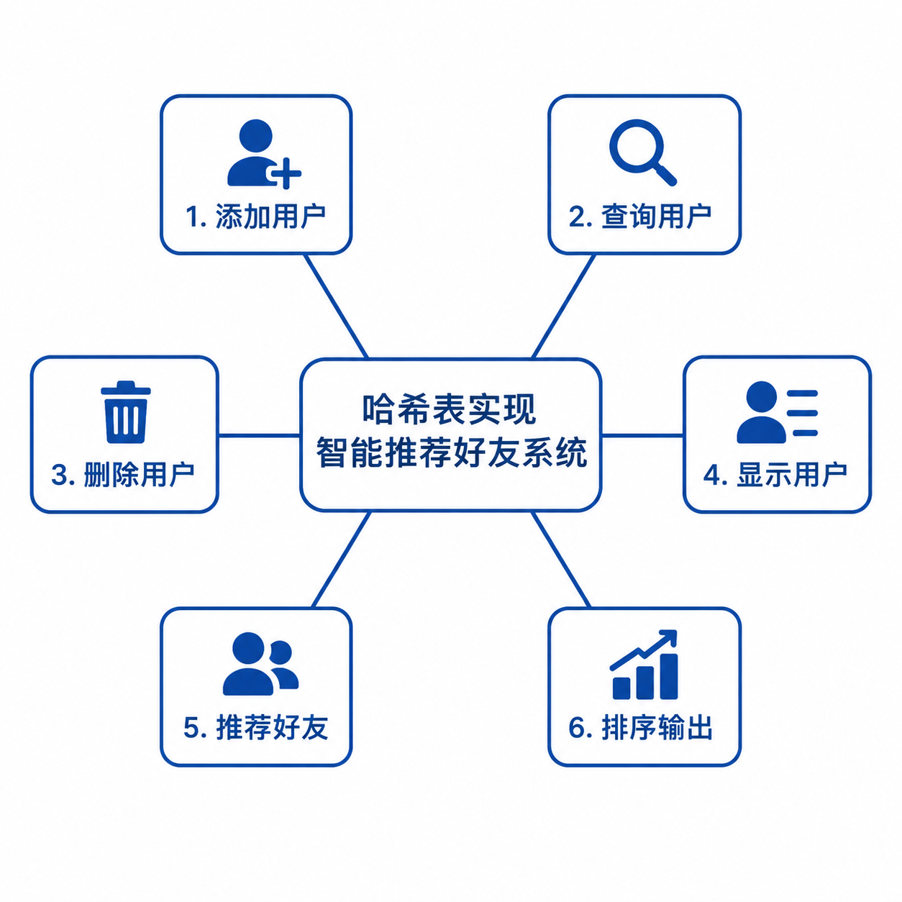
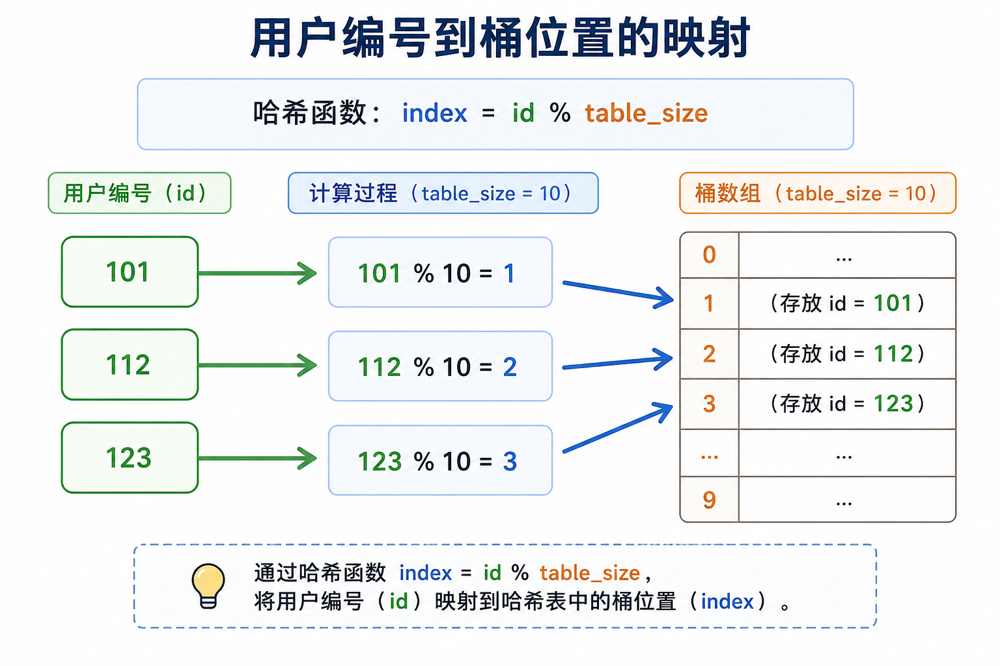
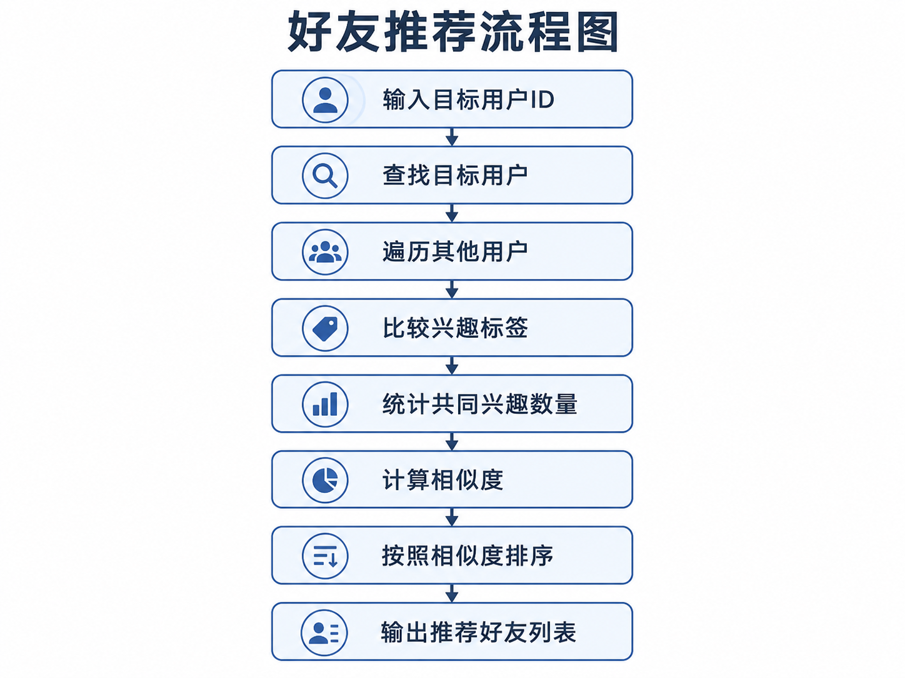
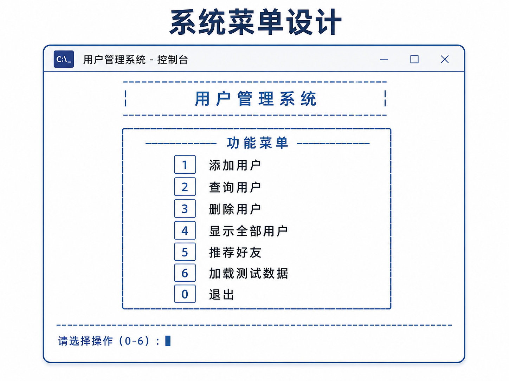
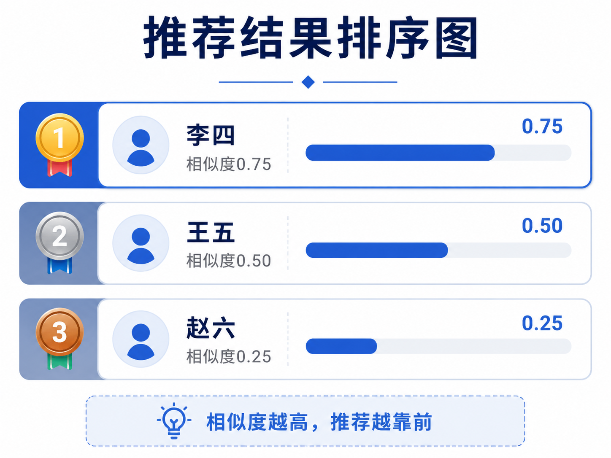
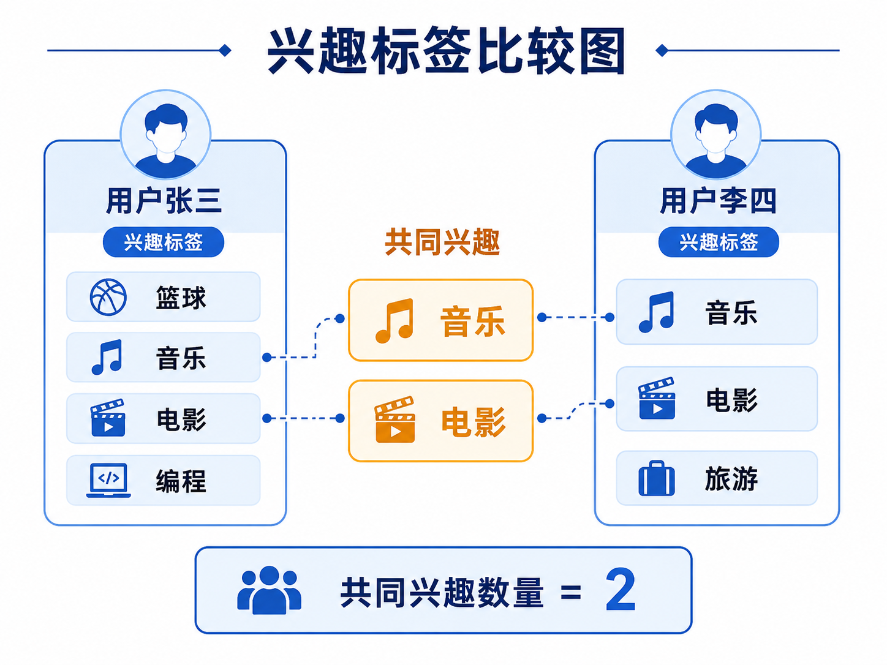
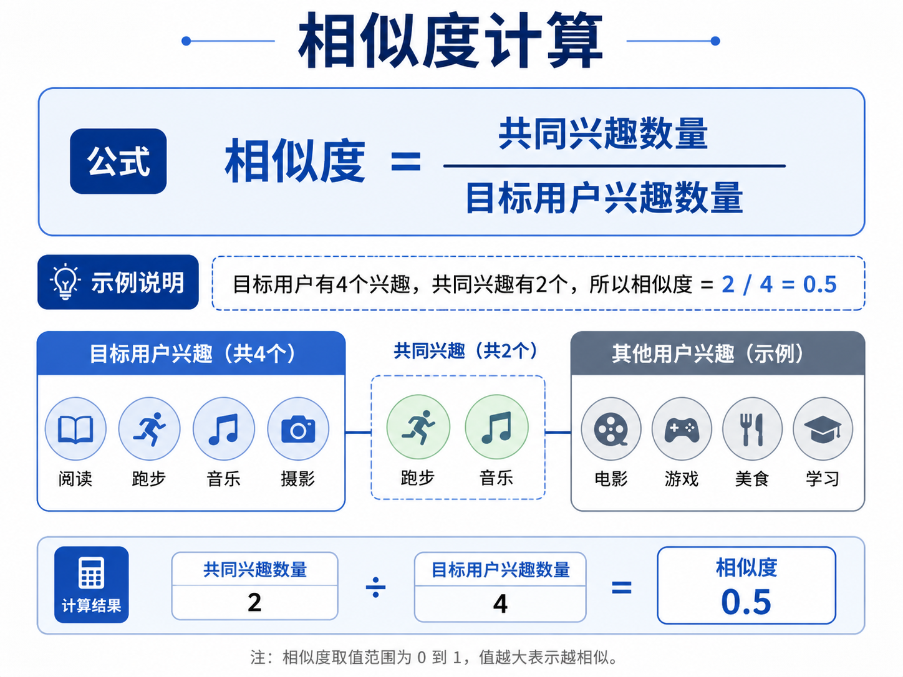
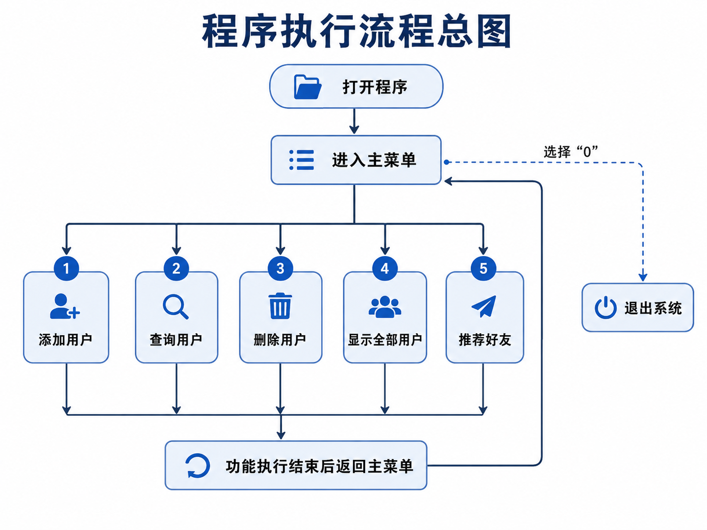

# Hash Table Friend Recommendation System

## 哈希表实现智能推荐好友系统

[](https://isocpp.org/)
[](LICENSE)
[]()

A C++ console application that stores user information in a hash table and recommends similar friends based on interest tags. This project was developed as part of a Data Structures course at Jiangsu Normal University.

本系统是一个 C++ 控制台程序，使用哈希表存储用户信息，并根据兴趣标签推荐相似好友。江苏师范大学数据结构课程设计项目。

---

## Table of Contents

- [Features](#features)
- [Architecture](#architecture)
- [Data Structure Design](#data-structure-design)
- [Recommendation Algorithm](#recommendation-algorithm)
- [Getting Started](#getting-started)
- [File Structure](#file-structure)
- [Authors](#authors)

---

## Features

- Add, query, and delete user information
- Hash table storage with collision handling via vector
- Interest-based friend recommendation
- Similarity scoring and ranked output
- Built-in test data loader

---

## Architecture

The system consists of five main modules:

| Module | Description |
|--------|-------------|
| Menu Interaction | Display the menu and route user input to the corresponding function |
| User Management | Add, query, delete, and display user information |
| Hash Table Storage | Store users in buckets using `id % table_size` |
| Friend Recommendation | Traverse other users and compare interest tags |
| Result Sorting | Sort recommendations by similarity score in descending order |


---

## Data Structure Design

### Hash Table

The core data structure is an array of size 10, where each slot is a bucket containing a `vector<User>`:

```cpp
const int table_size = 10;
vector<User> hashTable[table_size];
```

Users are mapped to buckets via the hash function:

```cpp
int hashFunction(int id) {
    return id % table_size;
}
```

When multiple users hash to the same bucket, they are stored together in the same vector -- this is how hash collisions are handled.





### User Structure

```cpp
struct User {
    int id;
    string name;
    int age;
    vector<string> interests;
};

struct RecommendResult {
    User user;
    int sameInterestCount;
    double similarity;
};
```



---

## Recommendation Algorithm

The recommendation process works as follows:

1. Find the target user by ID
2. Traverse all other users in the hash table
3. Compare interest tags and count common interests
4. Calculate similarity score
5. Sort results by similarity in descending order

**Similarity Formula:**

```
similarity = commonInterestCount / targetUserInterestCount
```









---

## Getting Started

### Prerequisites

- A C++ compiler supporting C++17 (e.g., g++, MinGW, MSVC)

### Build

```bash
g++ -std=c++17 src/main.cpp -o FriendRecommendSystem
```

### Run

```bash
./FriendRecommendSystem
```

### Quick Start

1. Select option `6` to load the built-in test data
2. Select option `4` to display all users
3. Select option `5` and enter user ID `101` to see friend recommendations



---

## File Structure

```
.
├── README.md
├── LICENSE
├── .gitignore
├── src/
│   └── main.cpp              # Source code
├── screenshots/              # Project diagrams
│   ├── 01-topic-overview.png
│   ├── 02-system-structure.png
│   ├── 03-hash-table-buckets.png
│   ├── 04-hash-function.png
│   ├── 05-hash-collision.png
│   ├── 06-user-structure.png
│   ├── 07-recommend-flow.png
│   ├── 08-interest-compare.png
│   ├── 09-similarity-formula.png
│   ├── 10-result-ranking.png
│   ├── 11-console-menu.png
│   └── 12-program-flow.png
└── docs/
    └── sample_input.txt       # Test data description
```

---

## Authors

**He Ming** (259007047) | **Zhou Runyan** (259007076)

School of Artificial Intelligence and Computer Science (Smart Education College)

Jiangsu Normal University

Software Engineering, Class 25zhi72
